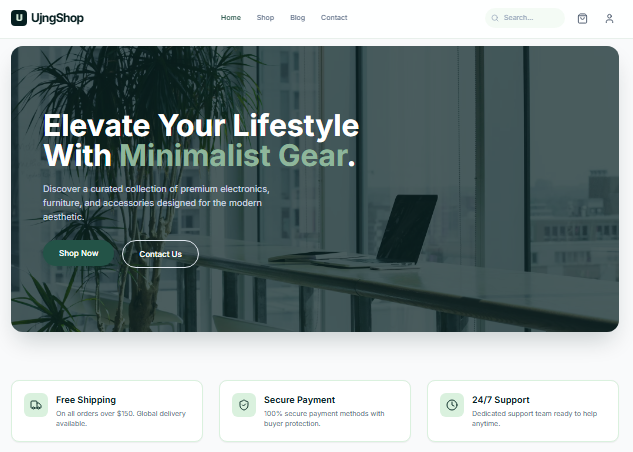

<div align="center">

# 🛍️ Minimalist Gear Store

**Elevate Your Lifestyle With Minimalist Gear**



*A modern e-commerce platform built with React, Vite, and Tailwind CSS*

</div>

## 🚀 About The Project

Minimalist Gear Store is a sleek and modern e-commerce website featuring premium electronics, furniture, and accessories designed for the contemporary lifestyle. Built with cutting-edge web technologies for optimal performance and user experience.

## ✨ Features

- 🛒 Modern product catalog
- 🎨 Clean, minimalist design
- 📱 Fully responsive layout
- ⚡ Blazing fast performance with Vite
- 🎯 Tailwind CSS for consistent styling
- 🔒 Secure checkout process

## 🛠️ Tech Stack

- **Frontend:** React 18 + TypeScript
- **Build Tool:** Vite
- **Styling:** Tailwind CSS
- **Icons:** Lucide React
- **Deployment:** Vercel/Netlify

## 📦 Installation

**Prerequisites:** Node.js (version 18 or higher)

1. Clone the repository:
   ```bash
   git clone https://github.com/your-username/minimalist-gear-store.git
   cd minimalist-gear-store

   Install dependencies:
   npm install

  Start the development server:
  npm run dev

  🏗️ Build for Production
  npm run build


📁 Project Structure
src/
├── components/     # Reusable React components
├── pages/         # Page components
├── styles/        # Custom styles
├── assets/        # Images and static files
└── utils/         # Helper functions

📞 Contact

flshujng@gmail.com
https://github.com/ujngflsh